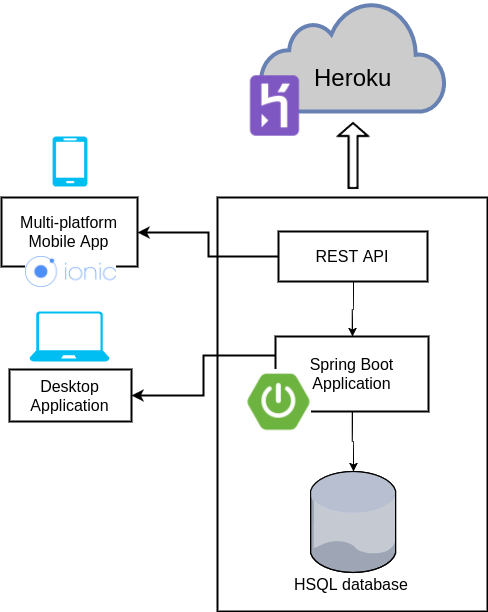

Team 14's Code For Good: 2017 Intern Edition Project

The aim of the project is to tackle the [UN Sustainable Development goals](http://www.un.org/sustainabledevelopment/sustainable-development-goals/). 

We have created a platform for allowing people who are unemployed, and have difficulty finding work due to lack of experience, to build up their reputation and skillset by doing charity-sponsored voluntary work.

People who are looking for work to be done can post jobs to the platform, which can be viewed by prospective workers.

The diagram shows the software architecture of the project:

[Architecture Diagram](codeforgoodarchitecture.png)
